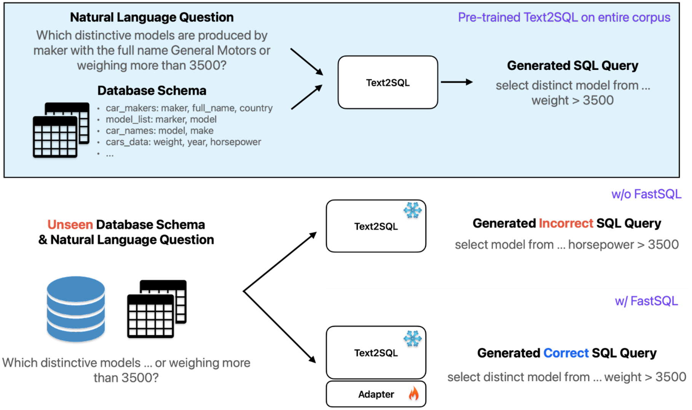

<p align="left">
    <br>
    
    <br>
<p>

# FastSQL: Ten minutes is enough to become SQL master.

## Quick Start

Install Conda using the provided script:

```bash
bash install_conda.sh
```

Install the required package(s):

```bash
bash install_package.sh
```

Download pretrained checkpoints, data and dataset using gdown and unzip them:

```bash=
gdown 1UWNj1ZADfKa1G5I4gBYCJeEQO6piMg4G
gdown 1QyfSfHHrxfIM5X9gKUYNr_0ZRVvb1suV
gdown 19tsgBGAxpagULSl9r85IFKIZb4kyBGGu
gdown 1s4ItreFlTa8rUdzwVRmUR2Q9AHnxbNjo

unzip -qq data.zip
unzip -qq database.zip
unzip -qq text2natsql-t5-base.zip
unzip -qq text2natsql_schema_item_classifier.zip

mkdir models/
mv text2natsql_schema_item_classifier/ models/
mv text2natsql-t5-base/ models/
```

Run inference using pretrained weight to validate score on the paper:

```bash
sh scripts/inference/infer_text2natsql.sh base spider 1
```

Divide above inference into preprocess process and evaluation process:

* **Preprocess data**
```bash
sh ./scripts/train/text2natsql/preprocess.sh
sh ./scripts/train/text2natsql/generate_text2natsql_dataset.sh
```

* **Evaluation**
```bash
python -u evaluate_text2sql_ckpts.py \
    --batch_size 8 \
    --device "1" \
    --seed 42 \
    --save_path "./models/text2natsql-t5-base" \
    --eval_results_path "./eval_results/text2natsql-t5-base" \
    --mode eval \
    --dev_filepath "./data/preprocessed_data/resdsql_dev_natsql.json" \
    --original_dev_filepath "./data/spider/dev.json" \
    --db_path "./database" \
    --tables_for_natsql "./data/preprocessed_data/tables_for_natsql.json" \
    --num_beams 8 \
    --num_return_sequences 8 \
    --target_type "natsql"
```

Reproduce training result on the paper and validata:

```bash
sh scripts/train/text2natsql/train_text2natsql_t5_base.sh
sh scripts/inference/infer_text2natsql.sh base-custom spider

# base-custom is trained by us
# base is provided pretrained checkpoint  
```

FastSQL Training & Evaluation scripts:

We select 2 out of 20 databases on Spider Dev Set.
* car
* dog_kennels


Full-finetuned:

```bash
sh car/train_text2natsql_t5_base.sh
sh dog_kennels/train_text2natsql_t5_base.sh
```

FastSQL:

```bash
sh car/train_text2natsql_t5_base_lora.sh
sh dog_kennels/train_text2natsql_t5_base_lora.sh
```

## Experiment Results

### Full Spider Dev Result with Pretrained Text2natsql-t5-base

```json
{
    "ckpt": "./models/text2natsql-t5-base/checkpoint-14352",
    "EM": 0.7408123791102514,
    "EXEC": 0.8017408123791102
}
```

### dog_kennels

**dog_kennels dev result w/ pretrained text2natsql-t5-base**

```json
{ "ckpt": "./models/text2natsql-t5-base/checkpoint-14352", "EM": 0.5909090909090909, "EXEC": 0.8636363636363636 }
```

**dog_kennels dev result w/ pretrained text2natsql-t5-large**

```json
{ "ckpt": "./models/text2natsql-t5-large/checkpoint-21216", "EM": 0.6666666666666666, "EXEC": 0.9047619047619048 }
```

**dog_kennels dev result w/ finetuned lora on text2natsql-t5-base**

```json
{ "lora_ckpt": "./models/text2natsql-t5-base-dog-kennels-lora/checkpoint-651.lora", "ckpt": "./models/text2natsql-t5-base/checkpoint-14352", "EM": 0.6666666666666666, "EXEC": 0.9523809523809523 }
```

**dog_kennels dev result w/ full finetuned text2natsql-t5-base**

```json
{ "ckpt": "./models/text2natsql-t5-base-dog-kennels/checkpoint-21", "EM": 0.5238095238095238, "EXEC": 0.9047619047619048 }
```

### car

**car dev result w/ pretrained text2natsql-t5-base**

```json
{ "ckpt": "./models/text2natsql-t5-base/checkpoint-14352", "EM": 0.4642857142857143, "EXEC": 0.6071428571428571 }
```json

**car dev result w/ pretrained text2natsql-t5-large**

```json
{ "ckpt": "./models/text2natsql-t5-large/checkpoint-21216", "EM": 0.5, "EXEC": 0.7142857142857143 }
```

**car dev result w/ finetuned lora on text2natsql-t5-base**

```json
{ "lora_ckpt": "./models/text2natsql-t5-base-car-lora/checkpoint-912.lora", "ckpt": "./models/text2natsql-t5-base/checkpoint-14352", "EM": 0.5, "EXEC": 0.7142857142857143 }
```

## Spider Datasets Stats

### Dev Set

| Database Name | Sample Count |
|--------------------------|-------|
| battle_death | 16 |
| car_1 | 92 |
| concert_singer | 45 |
| course_teach | 30 |
| cre_Doc_Template_Mgt | 84 |
| dog_kennels | 82 |
| employee_hire_evaluation | 38 |
| flight_2 | 80 |
| museum_visit | 18 |
| network_1 | 56 |
| orchestra | 40 |
| pets_1 | 42 |
| poker_player | 40 |
| real_estate_properties | 4 |
| singer | 30 |
| student_transcripts_tracking | 78 |
| tvshow | 62 |
| voter_1 | 15 |
| world_1 | 120 |
| wta_1 | 62 |

## Acknowledgements
Our code is mainly based on RESDSQL ([paper](https://arxiv.org/abs/2302.05965), [code](https://github.com/RUCKBReasoning/RESDSQL)).

Thanks PICARD ([paper](https://arxiv.org/abs/2109.05093), [code](https://github.com/ServiceNow/picard)), NatSQL ([paper](https://arxiv.org/abs/2109.05153), [code](https://github.com/ygan/NatSQL)), Spider ([paper](https://arxiv.org/abs/1809.08887), [dataset](https://yale-lily.github.io/spider)), Spider-DK ([paper](https://arxiv.org/abs/2109.05157), [dataset](https://github.com/ygan/Spider-DK)), Spider-Syn ([paper](https://arxiv.org/abs/2106.01065), [dataset](https://github.com/ygan/Spider-Syn)), Spider-Realistic ([paper](https://arxiv.org/abs/2010.12773), [dataset](https://doi.org/10.5281/zenodo.5205322)), Dr.Spider ([paper](https://openreview.net/pdf?id=Wc5bmZZU9cy), [dataset](https://github.com/awslabs/diagnostic-robustness-text-to-sql)), and CSpider ([paper](https://arxiv.org/abs/1909.13293), [dataset](https://taolusi.github.io/CSpider-explorer/)) for their interesting work and open-sourced code and dataset.
